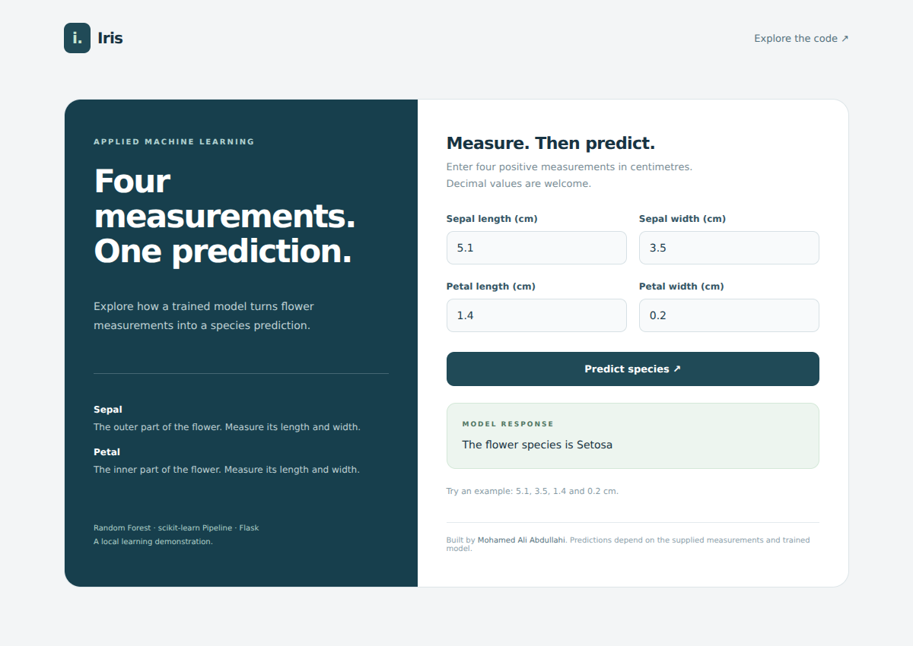

# Iris Classifier
<sub>PYTHON · FLASK · SCIKIT-LEARN · RANDOM FOREST</sub>

Four flower measurements go into a trained pipeline. A Flask form validates the input and returns the predicted species.



[Model walkthrough](docs/model-walkthrough.md) · [Training pipeline](train.py) · [Regression tests](tests/test_prediction.py)

## Why this example is useful

Training and inference share one saved scikit-learn Pipeline. Form values are read by feature name, so field order cannot silently swap the measurements. Missing, nonfinite and nonpositive values return HTTP 400.

The interface accepts decimals, keeps the submitted measurements visible and works at desktop and mobile widths. The screenshot shows the locally running app, not a mockup.

## Run locally

```bash
python -m venv .venv
# Activate .venv for your shell.
python -m pip install -r requirements.txt
python train.py
python flask-app.py
```

Open `http://127.0.0.1:5000`. The walkthrough includes a curl example for `POST /predict`.

## Verify

```bash
python -m unittest discover -s tests -v
```

Tests check decimal values, reordered form fields, invalid requests and agreement between the HTTP response and the saved pipeline. GitHub Actions runs these checks.

## Scope

The bundled Iris data uses a fixed stratified 70/30 split. Training prints held-out accuracy for that split; it is not an independent benchmark. The generated `model.pkl` stays outside source control. Load only models you trust.

The app binds to localhost with debug disabled. This is a learning demonstration. The original form reference to [this CodePen](https://codepen.io/frytyler/pen/EGdtg) is retained in the HTML.
